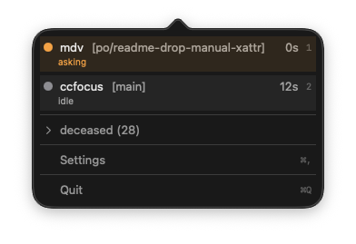

# ccfocus

A macOS menu bar app that tracks multiple Claude Code sessions and lets you jump to the Ghostty pane that triggered a notification.



## Requirements

- macOS Ventura (13.0) or later
- [Claude Code](https://claude.com/claude-code)

## Installation

```bash
brew install --cask negipo/tap/ccfocus
```

This installs `ccfocus` into `/Applications`, symlinks `ccfocus-logger` onto your `PATH`, clears the quarantine attribute, and registers the required hooks in `~/.claude/settings.json`.

To start the menu bar app:

```bash
open /Applications/ccfocus.app
```

## Uninstall

```bash
brew uninstall --cask ccfocus
```

The uninstall preflight removes ccfocus entries from `~/.claude/settings.json`. Use `brew uninstall --zap --cask ccfocus` to also remove logs and preferences.

## Keyboard

- `Tab` / `Shift+Tab` (panel focused): Cycle peek through sessions. Ghostty window is raised behind the panel without activating it.
- `Esc` / global hotkey: Close the panel. Commits the last peek (activates that Ghostty pane) if peeked, otherwise restores the previously active app.
- `1`–`9`, `0` (panel focused): Jump directly to the Nth session.
- Mouse click on `Cycle sessions` row: Advance peek by one step.

## Session states

Each tracked session appears in the menu bar with a colored dot and an optional label. States are listed in the order the user should handle them.

| State          | Color       | Label                | Meaning                                                                                 |
|----------------|-------------|----------------------|-----------------------------------------------------------------------------------------|
| `asking`       | orange      | last text / `asking` | Claude ended its turn with a question — respond immediately                             |
| `waitingInput` | orange      | notification message | Claude Code sent a Notification — a permission prompt, or an idle reminder ~60s after `done` |
| `idle`         | gray        | `idle`               | Session has started; waiting for the first user prompt                                  |
| `done`         | gray        | `done`               | Claude ended its turn without a question; stays `done` until Claude Code sends an idle notification (~60s), which lands it in `waitingInput` |
| `running`      | green       | —                    | Claude is working (prompt submitted, tool call in flight); you're waiting on Claude     |
| `stale`        | dim gray    | —                    | No events for 30+ min; escalates to `deceased` after ~2.5h without a tracked process    |
| `deceased`     | faded gray  | —                    | Claude process exited or Ghostty pane closed; terminal, collapsed at the bottom         |

## Building from source

For development:

```bash
git clone https://github.com/negipo/ccfocus.git
cd ccfocus
make install
```

This builds `ccfocus-logger` (CLI) and `ccfocus` (menu bar app), registers Claude Code hooks, and copies the app to `/Applications`.
