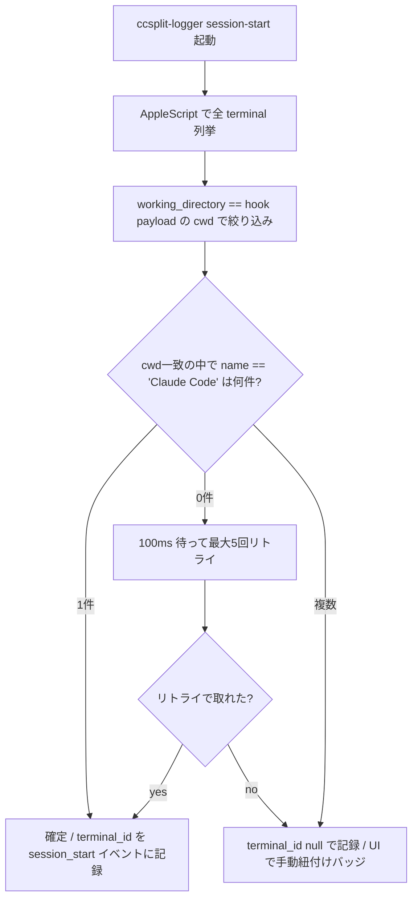
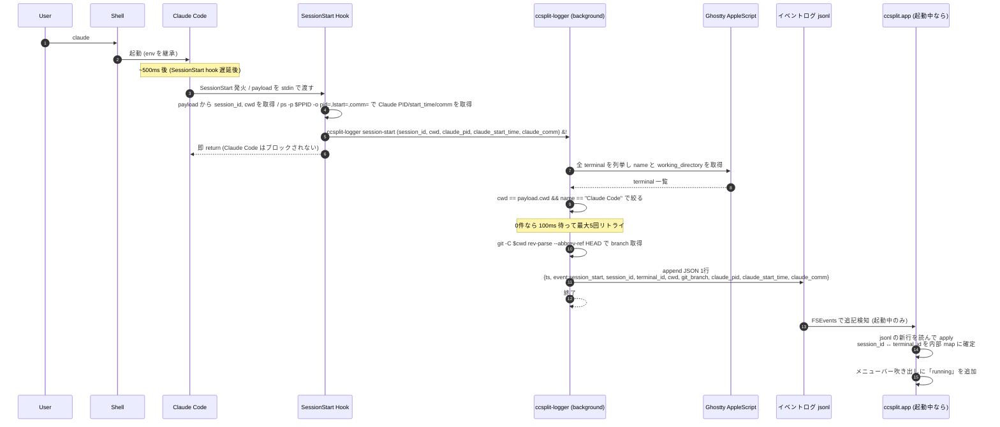
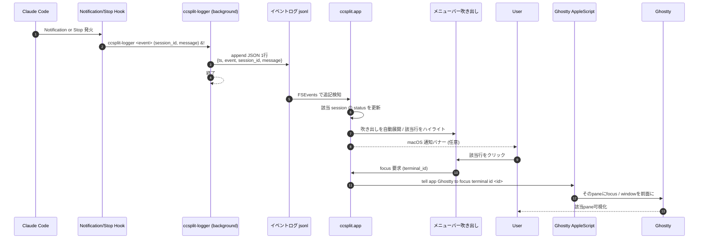
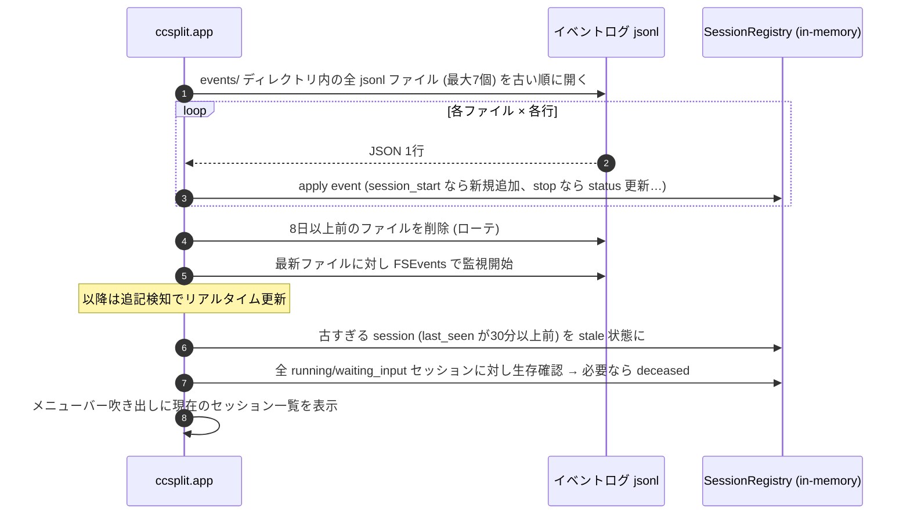
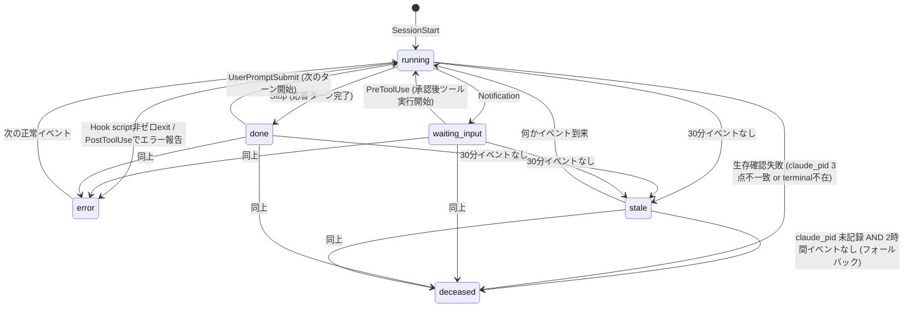
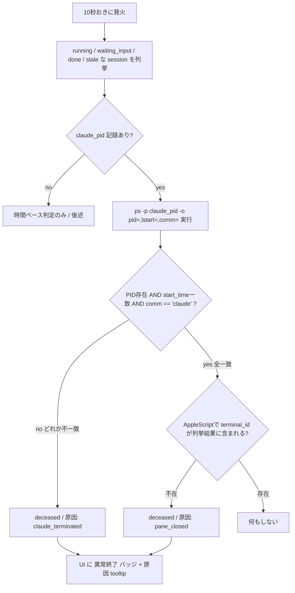

# ccsplit 設計

## 概要

複数のClaude Code セッションが走るGhostty paneを横断的に追跡し、通知が来たpaneへ瞬時に飛べるようにする macOSメニューバー常駐アプリ。状態の真実の源は append-only イベントログ (jsonl)、ccsplit.app は表示・操作層。

## 登場要素

- User: 人間
- Ghostty: ターミナルアプリ本体 (1.3+ AppleScript対応)
- Shell: zsh/bash/fish。Ghostty Surface内で動く (ccsplitは触らない)
- Claude Code: ユーザがshellで起動するAI agent
- Hook: Claude Code Hooks (SessionStart / Notification / Stop / PreToolUse / UserPromptSubmit) から呼ばれるスクリプト
- ccsplit-logger (CLI): 軽量別binary (Rust想定)。Hookから背景で呼ばれ、AppleScriptで pane を特定し、イベントログにJSON1行をappendしてすぐ終了
- イベントログ: 日次ローテーションされるappend-only jsonl ファイル群。永続的な真実の源 (source of truth)
- ccsplit.app: メニューバー常駐するMac Nativeアプリ本体 (1プロセス、SwiftUI + Cocoa)。起動時にイベントログを再生して状態復元、その後ファイル監視でリアルタイム追従、UI更新と AppleScript発行を担う
- AppleScript: GhosttyのScripting Bridgeインターフェース

## ccsplit.app の起動性質

ccsplit.app はソケットの listener ではない。状態の真実の源はイベントログファイルであり、ccsplit.app はその表示・操作層に過ぎない。

- ccsplit.app未起動でもCLIは普通にログ追記する。Claude Codeの起動は完全に独立
- ccsplit.appを後発で起動した場合、当日のログを先頭から再生して現状を復元
- ユーザにLogin Item登録を推奨はするが必須ではない
- ccsplit.appがクラッシュしてもログは無事。再起動で元通り

## イベントログの仕様

### 配置

```
~/Library/Application Support/ccsplit/events/YYYY-MM-DD.jsonl
```

日次ローテーション。

### 書き込み

CLIが各イベントをJSON 1行としてappend。O_APPEND原子追記に依存。1イベント500バイト超になり得る場合のみ flock を使う。

### 例

```json
{"ts":"2026-04-16T09:12:34.567Z","event":"session_start","session_id":"abc","terminal_id":"B9BE...","cwd":"/Users/negipo/src/github.com/negipo/ccsplit","git_branch":"po/ccsplit-design","claude_pid":12345,"claude_start_time":"Wed Apr 16 09:12:34 2026","claude_comm":"claude"}
{"ts":"2026-04-16T09:13:45.890Z","event":"notification","session_id":"abc","message":"approval needed for Bash"}
{"ts":"2026-04-16T09:14:30.123Z","event":"pre_tool_use","session_id":"abc","tool":"Bash"}
{"ts":"2026-04-16T09:15:00.123Z","event":"stop","session_id":"abc"}
{"ts":"2026-04-16T09:20:10.456Z","event":"user_prompt_submit","session_id":"abc"}
```

session_start イベントには:

- git_branch: CLIが `git -C <cwd> rev-parse --abbrev-ref HEAD` を一発実行して取得 (失敗時は null)
- claude_pid / claude_start_time / claude_comm: Hookスクリプト内で `ps -p $PPID -o pid=,lstart=,comm=` を一発実行して3点セットで取得。生存確認で「PID存在 + start_time一致 + comm=='claude'」の全一致を要求することで、PID再利用問題と Claude内部実装変更耐性を両立する

### 保持と日跨ぎセッションのハンドリング

保持期間は7日。8日以上前の jsonl ファイルは ccsplit.app 起動時 および 1日1回の周期タスクで削除。

ccsplit.app 起動時の SessionRegistry 再構築は events/ 内の全 jsonl ファイル (最大7個) を古い順に走査して行う。これにより:

- 日跨ぎ・週跨ぎセッション (claude --resume で何日も続いた作業) も SessionRegistry に正しく復元される
- 走査時間は数十ms以下、起動体感に影響しない

トレードオフ: 8日以上継続するセッションは ccsplit.app の再起動後に履歴が失われる。レアケースとして許容。気になる場合は保持期間を伸ばすconfigで対応する。

## ペイン特定アーキテクチャ: cwd + name="Claude Code" マッチング

Claude Code は起動直後にターミナル title を `Claude Code` 固定文字列に書き換える性質がある (タスクが始まると `⠂ XXX` `✳ XXX` 形式に変わる)。SessionStart Hook 発火時点 = 「立ち上げ直後」のため、この瞬間に AppleScript で全 terminal を列挙すれば、対象 pane は title="Claude Code" + cwd一致の組み合わせでほぼ一意に特定できる。



リトライは「Claude Codeが title を書く前」「書き換わった後」のタイミングずれを吸収する。

## フェーズ1: Claude Code起動時に session_id ↔ terminal.id を確定



ポイント

- ccsplit.app が未起動でも CLI は完全に動く。後で起動すればログ再生で復元
- Hookの同期処理は Hook script が即detachする数ms のみ。Claude Codeの起動を遅らせない
- AppleScript呼び出しは背景CLI内で実行 (列挙 + 絞り込みで 50〜150ms)
- ユーザの shell 設定 (.zshrc 等) は触らない

## フェーズ2: 通知到着 → ユーザがメニューバーから該当paneへ飛ぶ



## ccsplit.app 起動時のリプレイ



将来的に走査が重くなったら snapshot 最適化を入れる ([negipo/ccsplit#3](https://github.com/negipo/ccsplit/issues/3))。

## タスクの状態遷移マシン



設計上の意図

- waiting_input → stale 遷移は承認放置警告を兼ねる。Claude Code側のtimeoutに引っかかる前に気づかせる
- waiting_input → running は PreToolUse Hook (ツール実行が始まる瞬間 = 承認された) で遷移
- done → running は UserPromptSubmit Hook (同セッション内の次のターン開始) で遷移
- error は復帰可能なソフト状態。次の正常イベントで running に戻る
- stale は時間ベースの自動遷移 (ccsplit.app 内部タイマーで判定、ログには書かない)
- deceased は2系統で判定: (1) 生存確認の3点チェック失敗 (常時) (2) claude_pid 未記録セッションのみ、stale 遷移後さらに2時間継続したらフォールバック発動。PID取得が成功しているセッションは時間経過のみで deceased 化されない (長時間離席・承認放置の正規live セッションを誤殺しないため)

## 生存確認 (liveness check)

ファイルベースのイベントログだけだと、Stop hookが発火しないまま終わったセッションは running のまま残る。発生シナリオは2系統:

- Claude Code 本体が死んだ (Ctrl+C, /exit, /q, APIエラー終了 など)。pane は残る
- pane ごと消えた (Ghostty pane閉じ、Ghosttyクラッシュ、Macスリープ復帰失敗 など)

両方を ccsplit.app 内の10秒周期タスクで検出する。

### PIDベース3点チェック (一次判定)

PID単独では再利用問題で誤判定する (ccsplit.app停止中にClaude終了 → 同PIDが別プロセスに付与 → 再起動時の `kill()` が誤って成功)。これを防ぐため、session_start時に取得した `(claude_pid, claude_start_time, claude_comm)` の3点全一致を要求する。



3点一致を要求することで:

- PID再利用: 別プロセスは start_time が違うので弾ける
- Claude内部実装変更で `$PPID` が別プロセスを指すケース: comm が 'claude' でなければ初手で claude_pid=null として記録、PIDベース判定は最初から発動しない

### 時間ベース判定 (claude_pid 未記録セッション専用フォールバック)

PIDベース3点チェックは PID取得が成功している場合のみ働く。`claude_pid` を取得できなかった (Hookの `$PPID` が想定外プロセスだった、`comm != claude` だった等) セッションは PIDベース判定が発動しない。これらだけは時間ベースで救う。

条件:

- `claude_pid` が null で記録されたセッションのみ対象
- かつ stale 遷移後さらに2時間 (= 計2時間30分イベントなし) で deceased に遷移

PIDベース判定が機能しているセッションには時間ベースの強制死亡判定はかからない。長時間離席、承認放置、対話の長期休止など正規の live セッションは生き続ける。

これにより:

- `$PPID = Claude本体` の前提が将来崩れて claude_pid=null が増えても、heartbeat切れた長期放置の死んだセッションは最終的に deceased になる
- 通常運用 (PID取得成功) では、ユーザの離席時間に依らず正しく live を維持する

判定はin-memoryのみ。ログには書かない。ccsplit.app 再起動時はまた生存確認から再構築する。

### 上流対応の優先化

PIDベースは内部実装依存で本質的に脆い。Claude Code 本体に `SessionEnd` 相当の明示終了hookを追加してもらう upstream PR を最優先で出す。これがmergeされれば PID追跡は補助に降格でき、設計の脆さが大幅に減る。

## 内部データモデル (ccsplit.app 内、イベントログから派生する派生状態)

```
SessionRegistry
  session_id  -> terminal_id, cwd, git_branch,
                 claude_pid, claude_start_time, claude_comm,
                 status (running | waiting_input | done | error | stale | deceased),
                 deceased_reason (claude_terminated | pane_closed | timeout | null),
                 last_event, started_at, last_seen,
                 current_task_title (AppleScript で都度問い合わせ可)

UI が読むビュー
  for session in SessionRegistry sorted by last_event desc:
    title = AppleScript で session.terminal_id の name を都度取得
    render(session.session_id, title, session.status, session.git_branch)
```

中間キーとしての pane_uuid は不要。session_id を直接の鍵にする。SessionRegistry はイベントログから派生する純粋な投影 (projection) であり、永続化は不要 (起動時にログから再構築)。

## メニューバー吹き出しUI

### 並び順

`last_event` 降順 (最新イベントが最上位)。これにより:

- 直近 Notification が来た waiting_input セッションが自動で上に来る
- 古い done や stale, deceased は下に沈む
- 並び自体はピン留めしない (純粋な時刻順)

### 行レイアウト

通常時 (1行表示、last_event が新しい順):

```
●  olive    [main]        15s
○  backend  [feature/x]   42s
●  ccsplit  [po/design]   3m
◌  another  [main]        2h
```

waiting_input が混ざる時 (該当行のみ展開):

```
○  backend  [feature/x]   42s
● ▼ olive   [main]        1m  ← 強ハイライト (橙)
   "Approve Bash command: rm -rf foo"
●  ccsplit  [po/design]   3m
◌  another  [main]        2h
```

各行の構成要素

- 状態インジケータ (色付き丸): running=緑、waiting_input=橙、done=灰、error=赤、stale=薄灰、deceased=取り消し線+灰
- cwd basename
- git_branch (記録されていれば角括弧内)
- 経過時間 (last_event からの相対時間)

deceased セッションは「最近終了」セクションに折りたたみ、もしくは並びの一番下。`last_seen` から24時間経過でUI表示から外す (ログは残す)。

### 自動展開

Notification 受信時に吹き出しを自動展開し、該当行の2行目にメッセージを表示する。クリックで該当paneへフォーカス。

### macOS通知バナー

デフォルトでは Notification 受信時のみ出す。設定で off 可能。Stop はバナー出さない (吹き出しの色変化のみ)。

### 未紐付けセッションの扱い

terminal_id が null のまま記録されたセッションは「未紐付け」バッジを付けて表示。クリックで「該当paneを選んでください」UIを開き、現在開いているpane一覧から手動選択。選択結果は ccsplit.app 内の補助マップに保存し、以降は紐付け済みとして扱う。

## ユーザ側のセットアップ

`~/.claude/settings.json` に追記:

```json
{
  "hooks": {
    "SessionStart":     [{"hooks": [{"type": "command", "command": "ccsplit-logger session-start"}]}],
    "Notification":     [{"hooks": [{"type": "command", "command": "ccsplit-logger notification"}]}],
    "Stop":             [{"hooks": [{"type": "command", "command": "ccsplit-logger stop"}]}],
    "PreToolUse":       [{"hooks": [{"type": "command", "command": "ccsplit-logger pre-tool-use"}]}],
    "UserPromptSubmit": [{"hooks": [{"type": "command", "command": "ccsplit-logger user-prompt-submit"}]}]
  }
}
```

PreToolUse は waiting_input → running の遷移、UserPromptSubmit は done → running の遷移を駆動する。これらが無いと一度 waiting_input/done に入ったセッションが恒久的に戻らなくなるため必須。

将来は ccsplit を Claude plugin として配布し、`/plugins install ccsplit` 一発で hook 設定まで完了させたい。

## 選択しなかった方法

検討の過程で出た代替案を、なぜ採用しなかったかと共に記録する。

### α: claude wrapper / shell alias 方式

`alias claude=ccsplit-wrap claude` で claude起動を wrapper でくるみ、起動時に Ghostty AppleScript で focused terminal の id を環境変数に注入してから exec する。ペイン特定は100%確実。

却下理由: shell設定への侵襲が大きい。wrapper の存在をユーザが意識する必要があり、再起動・shell切替時のセットアップ負担が高い。

### β: ppid 遡り + cwd 照合 方式

Hook内で ps を使って親プロセスを遡り、shellのPIDから対応する Ghostty terminal を AppleScript で照合する。

却下理由: AppleScript SDEFには tty/pid プロパティがなく、shell PID と terminal を対応付ける手段がない。cwd マッチングだけでは同 cwd 複数pane時に区別不能。

### β': SessionStart Hook 内 OSC タイトルマーカー方式

Hook内で `printf '\033]0;CCSPLIT-MARKER-<uuid>\007'` でタイトルに一意マーカーを書き、ccsplit.app側で AppleScript列挙してマーカーを持つterminalを発見、id を取得して紐付ける。

却下理由: タイトルが他主体 (Claude Code, oh-my-zsh, tmux等) によって即座に上書きされる可能性が高くフラジャイル。書いた直後の極短い窓でしか機能しない。

### β''': zshrc 同期 osascript 方式

`.zshrc` 内で同期的に `osascript` を叩いて自paneの terminal.id を環境変数に取り込み、Hookで読む。

却下理由: shell起動毎に osascript呼び出し (50-150ms) が走り、shell起動体感を悪化させる (mise activate ですら嫌われるレベル)。

### β'''': zshrc 非同期 + socket 方式

`.zshrc` から `ccsplit register --async ... &!` でバックグラウンド送信、osascript 呼び出しは背景プロセスで実行。socket 経由で常駐アプリへ通知。

却下理由: zshrc に1行とはいえ追加が必要 (ユーザ却下)。さらにbash/fish/nu 等 shell毎にスニペットを用意する必要がある。

### β5: 非同期 focused-terminal 取得 方式

SessionStart Hook 内で背景プロセスを起動し、`get id of focused terminal of selected tab of front window` で取得。「claude打鍵直後はfocusが自paneに留まっている」前提。

却下理由: Claude Code 1.0.x で SessionStart Hook 実行が約500ms 遅延するようになった (changelog: "Improved startup performance by deferring SessionStart hook execution, reducing time-to-interactive by ~500ms")。この遅延の間にユーザが別paneをクリックすると focused terminal が別paneを指してしまう。fallback は cwd マッチングだけで、同cwd複数paneで決定不能。コア価値に穴。

### γ: ccsplit.app 経由 split + 環境変数注入 方式

ccsplit.app から AppleScript の `split` コマンドで新terminalを作成、その時に `surface configuration` の `environment variables` に `CCSPLIT_PANE_UUID=<uuid>` を渡す。AppleScript が返す terminal.id と uuid を内部マップに記録、Hookでは env から uuid を読むだけ。race完全消滅。

却下理由: 「claude用split は ccsplit.app 経由で開く」という制約をユーザワークフローに強いる。ccsplit を介さず開いた pane で claude を起動する既存ワークフローが捨てられる (未紐付け扱いになる)。コア体験に強い縛りが入りすぎる。

## upstream PR (最優先課題)

設計の脆さを根本から消すために、2つのupstreamへPRを出す。これらが入れば現在の設計の妥協点が大幅に解消する。

### Claude Code: SessionEnd hook (最優先)

現状、Claude Code の終了 (Ctrl+C, /exit, /q, APIエラー) を hook で検知する手段がない。設計はPID3点チェック + 時間ベースフォールバックで凌いでいるが、PID追跡は内部実装依存で本質的に脆い。

`SessionEnd` 相当の明示終了hookが入れば:

- ccsplit-logger session-end が即座にイベントログに記録
- 生存確認の周期タスクが不要に (or 補助に降格)
- PID/start_time/comm の取得・記録も廃止可能

### Ghostty: terminal.surface_id property (中優先)

`terminal` クラスに `surface_id` プロパティを追加してもらう。

- `GHOSTTY_SURFACE_ID` env (子プロセスに既に注入されている) と `terminal.surface_id` の直接照合で確定可能
- cwd + name="Claude Code" マッチング自体が不要になり、ペイン特定が完全決定論的になる
- ccsplit-logger は単に「surface_id を terminal.id に変換してログ追記」する軽量呼び出しに置き換わる
- 同cwd複数pane時の「未紐付け→手動選択」UIフローも消える

## 設計の不変条件

- ユーザの shell 設定 (.zshrc / .bashrc / config.fish) には一切手を入れない
- Claude Code Hook の同期パスに osascript を入れない (常に背景detach)
- タイトルescape sequence は触らない
- ccsplit.app の起動状態に CLI は依存しない (常にログにappendするだけ)
- session_id を一次キーとし、terminal_id は派生属性として保持する
- イベントログが真実の源、SessionRegistry はその投影
- pane 特定の唯一の根拠は AppleScript で取れる terminal の name と working_directory のみ (env は使わない)
- 生存確認は (claude_pid, claude_start_time, claude_comm) の3点一致 + terminal_id 存在 で行う。PID単体は信頼しない
- PIDベース判定が機能しないケース (claude_pid=null) のみ、stale → deceased への時間ベース自動遷移 (2時間) でフォールバック。PID判定が機能しているセッションは時間経過のみで殺さない
- Claude Code upstream への SessionEnd hook PR は最優先課題

## 将来拡張のための開け口

- Codex CLI / Aider / opencode などへの対応が必要になったら、対応Hook相当の口を別途用意する。同じ `ccsplit-logger` を呼べばイベントログには同じ形式で記録され、ccsplit.app側のロジックは流用できる
- 同じpaneで複数セッションが順次走る場合、SessionRegistry に過去履歴をぶら下げる拡張で対応可能
- ログが大きくなって再生が重くなったら snapshot 最適化 ([negipo/ccsplit#3](https://github.com/negipo/ccsplit/issues/3))
- branch / cwd / message による検索・絞り込み ([negipo/ccsplit#1](https://github.com/negipo/ccsplit/issues/1))
- `claude --resume <session_id>` コマンドの表示とクリップボードコピー ([negipo/ccsplit#2](https://github.com/negipo/ccsplit/issues/2))
- イベントログそのものを他ツール (Slack通知 watcher / 統計可視化など) で読む二次利用が容易
